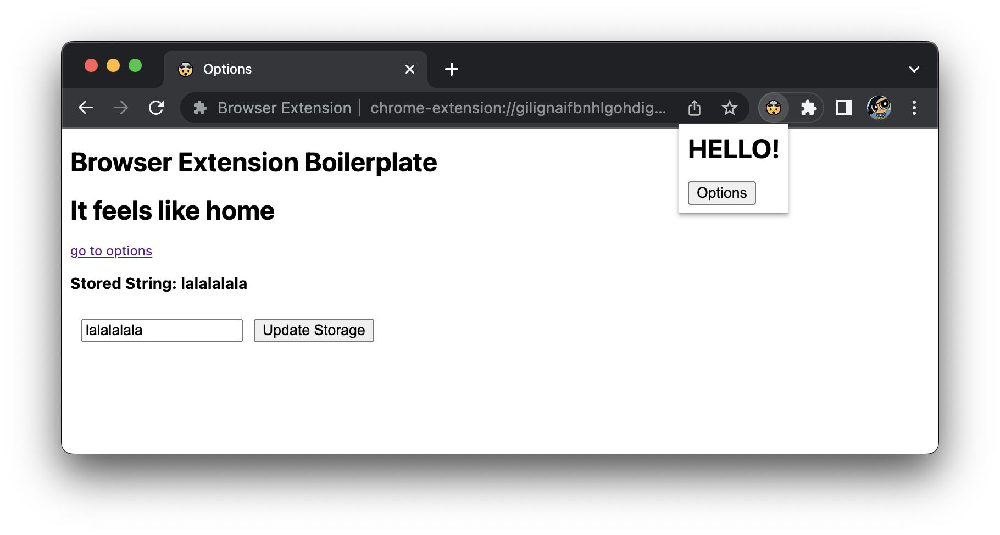

# Deno WebExtension Boilerplate

Boilerplate to build a Deno + Preact-UI Browser Extension. Basically, `built.ts`
uses esbuild to build js into the `dist` dir, and updates manifest stuff for v2
(ff) and v3 (chrome).

fwiw I built [Bext](https://github.com/bpevs/bext) so that you don't have to
think about it. `build.ts` here is basically the Bext `main.ts` script. But if
you want max control, I guess you can start here. This app is a mirror of the
[preact_example](https://github.com/bpevs/bext/tree/main/examples/preact_app) +
`build.ts`

You need to download [Deno](https://deno.land/) in order to build this app.

| Commands                  | What they Do      |
| ------------------------- | ----------------- |
| `deno run -A build.ts`    | bundles extension |
| `deno run -A build.ts -w` | watch extension   |

If you have bundled using make commands, you should be able to load your
unpacked extension using a browser.

